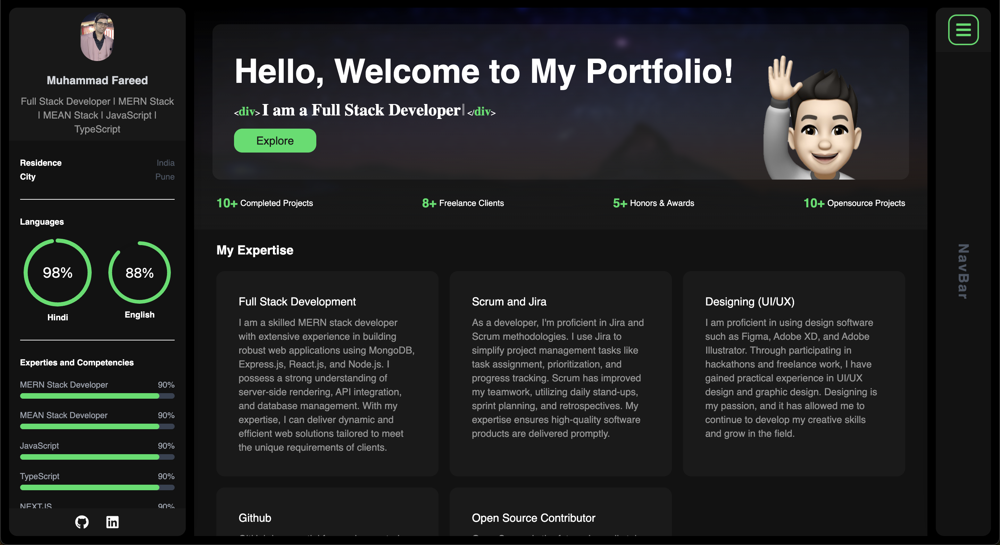

  <h2 align="center">Muhammad Fareed - Personal Portfolio</h2>

<a href="https://awwalfareed.netlify.app"><strong>➥ Live Demo</strong></a>

 

### Demo Screeshots

### Prerequisites

Before you begin, ensure you have met the following requirements:

- [Git](https://git-scm.com/downloads "Download Git") must be installed on your operating system.

### Run Locally

To run **portfolio** locally, run this command on your git bash:

### License

This project is **free to use** and does not contains any license.
